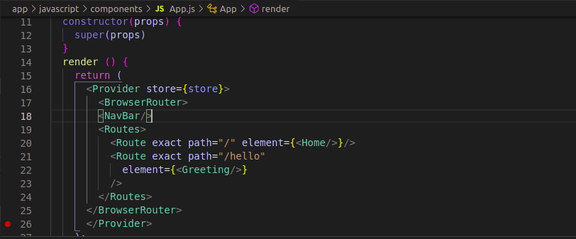

# README
# Hello-Rails-React app


This README would normally document whatever steps are necessary to get the
application up and running.
> The Backend of a React & Ruby on Rails setup.
---
Things you may want to cover:
## React Frontend [Link](https://github.com/azy64/hello-rails-react.git)

* Ruby version
## Built With

* System dependencies
- Ruby
- Ruby on Rails
- React-Rails
- RSpec
- CapyBara

* Configuration
## Getting Started

* Database creation
To get a local copy up and running follow these simple example steps.

* Database initialization
```
git clone https://github.com/azy64/hello-rails-react.git
```

* How to run the test suite
and then run

* Services (job queues, cache servers, search engines, etc.)
```
bundle install
```

* Deployment instructions
## Development

* ...
start of by creating the database and running migrations using
`bin/rails db:setup`

to start the server run `./bin/dev`

## Testing
to test simply run `rspec spec`


👤 **Azaria SAIDI**

- GitHub: [@azy64](https://github.com/azy64)
- LinkedIn: [LinkedIn](https://www.linkedin.com/in/azaria-saidi-524780112/)

## 🤝 Contributing

Contributions, issues, and feature requests are welcome!

Feel free to check the [issues page](../../issues/).

## Show your support

Give a ⭐️ if you like this project!